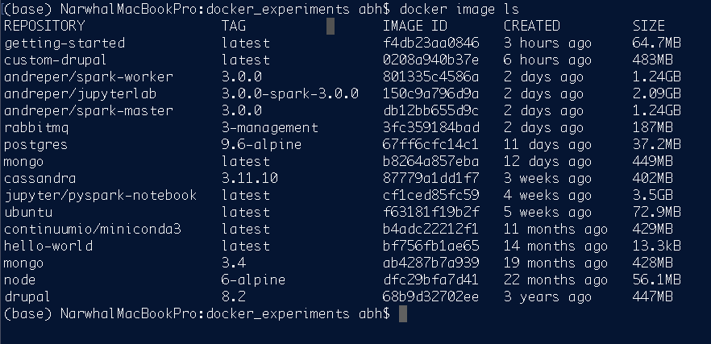
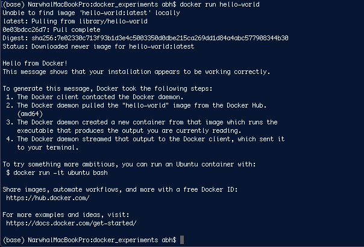
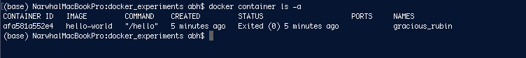
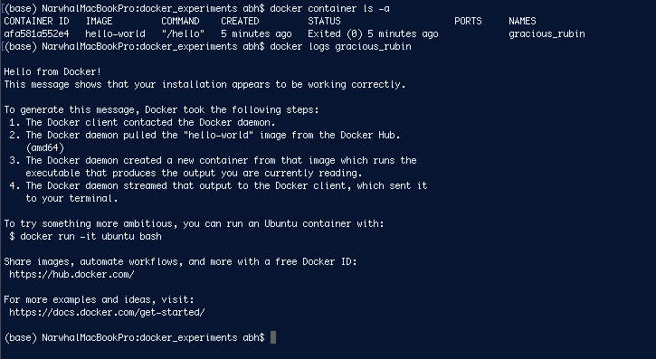

# A whistle-stop tour of Docker
## What is Docker?

Docker is containerisation software that allows us to package up software and apps with all of their dependencies in a lighweight manner that allows us to share containers in a scalable and easy manner.

## Docker commands

Get a list of all the docker images:

```docker image ls```


---

Start a container running the ```hello-world``` image

```docker run hello-world```


---

Try and remove the docker image we just downloaded

```docker image rm hello-world```

This fails and we get an error message like:

```Error response from daemon: conflict: unable to remove repository reference "hello-world" (must force) - container 6d51de6adb50 is using its referenced image bf756fb1ae65```

This is because there is a "stopped" container based on this image. Even though we launched a container and it immediately stopped there is still a copy of that specific container.

To show a list of running containers we run:

```docker container ls```

But nothing is running, we already know our container stopped and so we need to use the ```-a``` flag to see **ALL** containers!

```docker container ls -a```


---

Since we still have the container there we can also inspect the logs; this would work if the container was running live as well as stopped. There are specific flags or ways if you need to actively monitor logs but we won't worry about that now. We can inspect the logs using

```docker logs <name or container id>```

For our hello-world container (called gracious_rubin in this instance) we see a repeat of the original text that was pushed to us when we ran the programme. By default Docker logs everything that goes to *stdout*.


---

Tidying up after ourselves. It's easy to fill your system with experiments so make sure to clean up when you don't need containers/images anymore.

To remove our container we can use either the name or container id:

```docker container rm gracious_rubin```

if the container was still running and we want to force removal we would need the ```-f``` flag 

```docker container rm gracious_rubin```

Once we don't have any containers using an image anymore we can then remove that image using:

```docker image rm hello-world```

---

## A practical example with MongoDB

We will start a mongodb version 3.4 server running and then write and read data to it from Python.

```docker run -d --publish 27017:27017 --name myMongoDB mongo:3.4```

This will run Mongo in a detached mode in the background and will open port 27017 to our computer.

### Testing our database out using Python

From Python we can connect to our database and add records and delete records (see the notebook: ).

The code we used is summarised below

```
import pandas as pd
from pymongo import MongoClient

# This establishes a connection to Mongo

client = MongoClient('localhost', 27017)

# Connect to a database called "movie_db", 
# if it doesn't exist it will create a new database
db = client["movie_db"]

# Connect to a collection called "fave_movies", 
# if it doesn't exist it will create a new collection
collection = db["fave_movies"]

# Make some fake data
sample_movie1 = {
    "Title": "Star Wars",
    "Director": "George Lucas",
    "Year": 1977
}

sample_movie2 = {
    "Title": "Tenet",
    "Director": "Christopher Nolan",
    "Year": 2020    
}

all_data = [sample_movie1, sample_movie2]

# Bulk insert our list of movies
result = collection.insert_many(all_data)

# Query a random record (its not really random, it is the 1st record)
collection.find_one()

# Extract all the records and put them in a DataFrame
pd.DataFrame(collection.find())
# Show there are 2 records in our collection so far
collection.estimated_document_count()

# Add a new movie with additional fields
sample_movie3 = {
    "Title": "Batman",
    "Director": "Christopher Nolan",
    "Actor": "Christian Bale",
    "Year": 2020,
    "BoxOffice": 10000000
}

result = collection.insert_one(sample_movie3)

# Show the number of records has increased
collection.estimated_document_count()

# If we store the data in a DataFrame we get blank fields
pd.DataFrame(collection.find())

# If we store the data in a list we only get the original fields
for record in list(collection.find()):
    print(record)
```

## Shutting everything down!

Once we have finished we need to:
1. Stop the container - ```docker container stop myMongoDB```
2. Remove the container - ```docker container rm myMongoDB```
3. (Optional) Remove the image if we don't think we need it again - ```docker image rm mongo:3.4```


