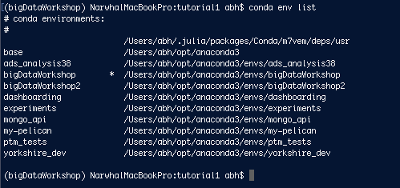

# RabbitMQ Experiment 1

We will be using the command line a lot and we need to be using the correct conda environment so make sure you are working in a terminal where you have run:

```conda activate bigDataWorkshop```

If you aren't sure which environment you are running then you can check using the command below:

```conda env list```

You should see a list of environments where the current active one is marked with an asterisk like so -



## Building our first queuing system

We are going to build a very simple queuing system comprised of two simple Python programs:

1. A Producer
2. A Consumer


Our producer will send a variety of greetings to the the RabbitMQ message broker.

These will then be collected by the consumer and printed to screen.

The missing 3rd element is that we need to have the RabbitMQ messaging broker working in the background. We can launch this using Docker.

First pull the image as follows:

```docker pull rabbitmq:3-management```

We can then launch the system with:

```docker run --rm -it --hostname my-rabbit -p 15672:15672 -p 5672:5672 rabbitmq:3-management```

The port 5672 is used for connecting to the RabbitMQ client.

We can use the default username and password ```guest:guest``` to log on to the web monitor at port 15672.
